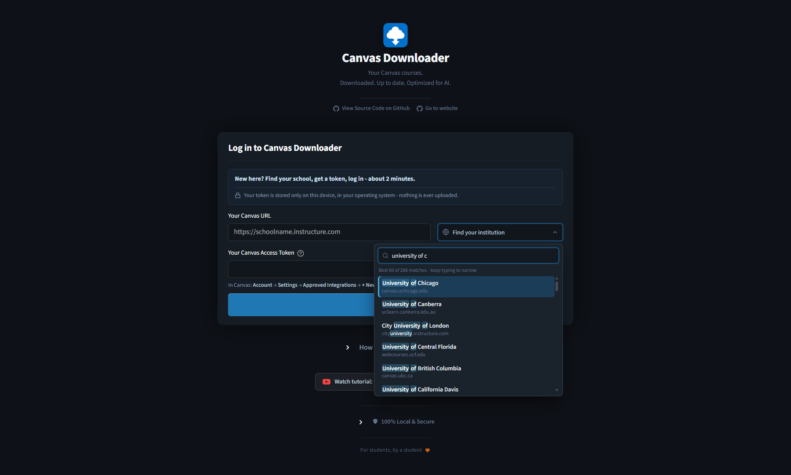
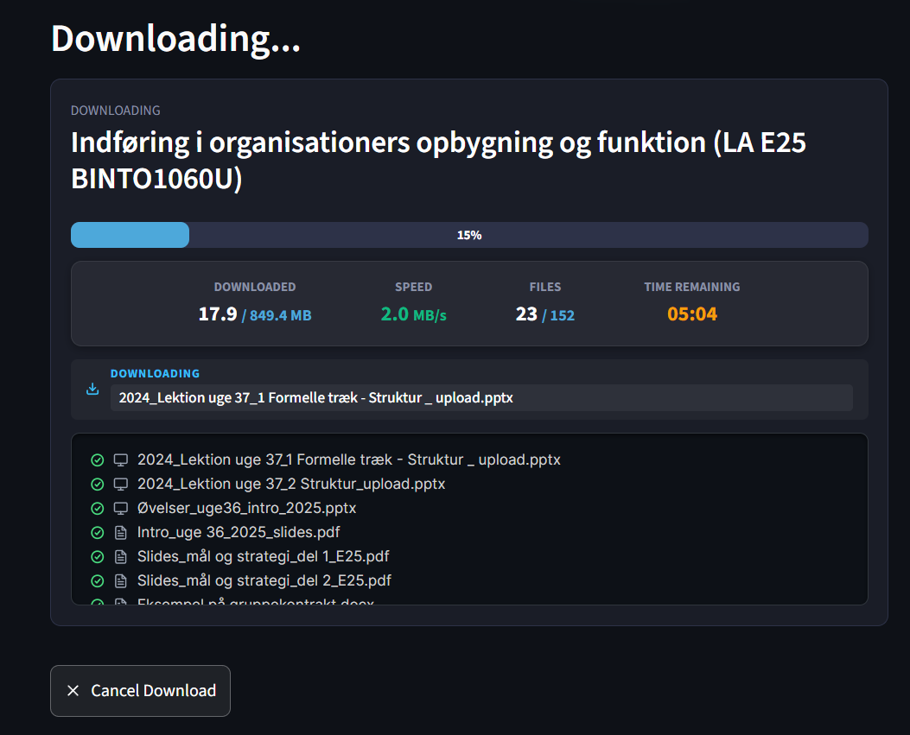
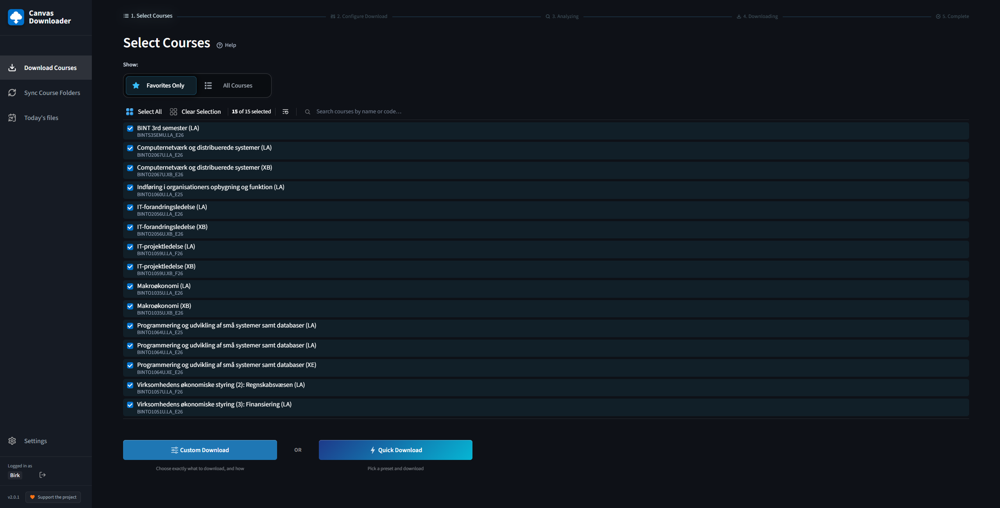
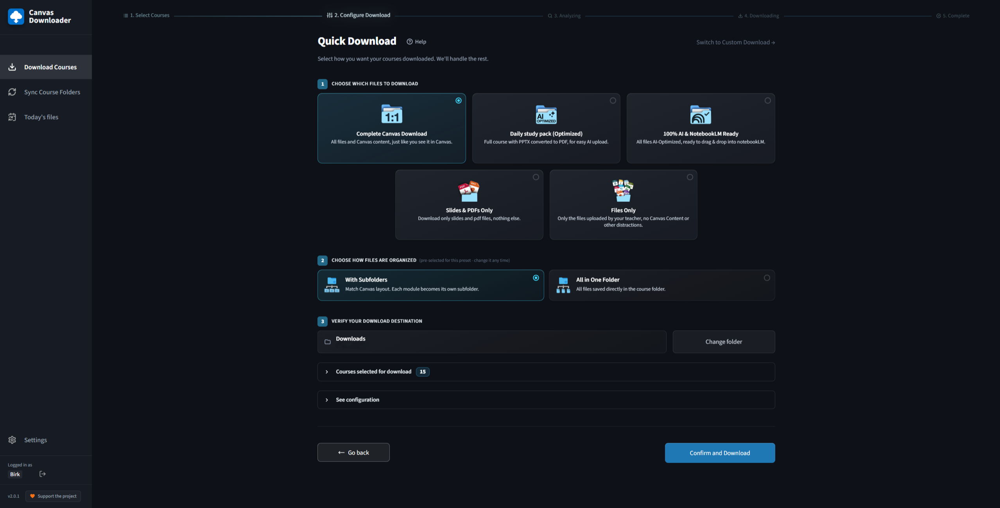
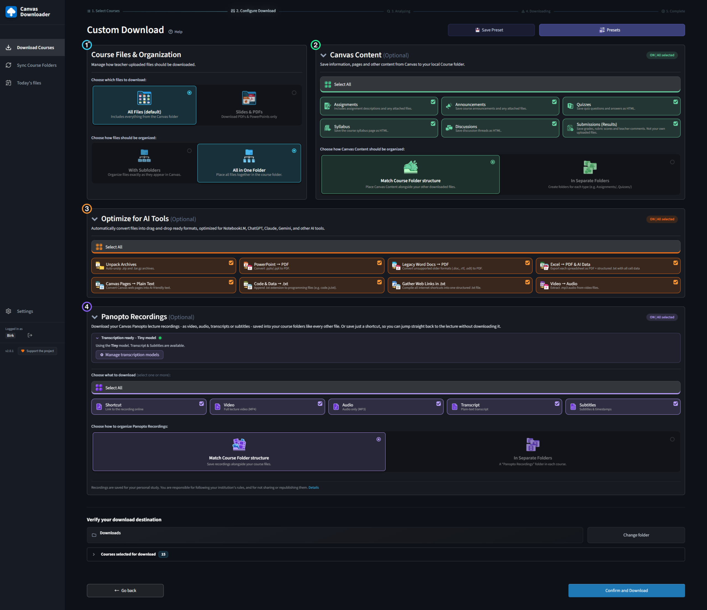
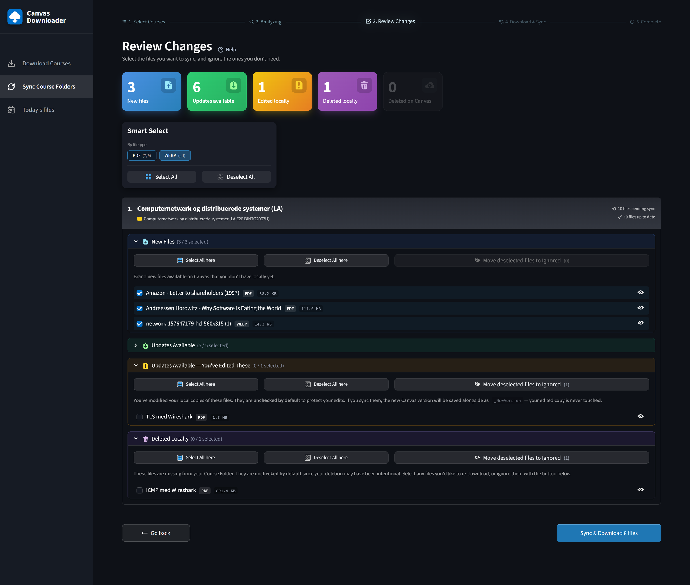
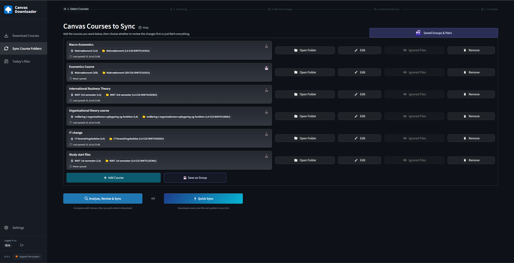
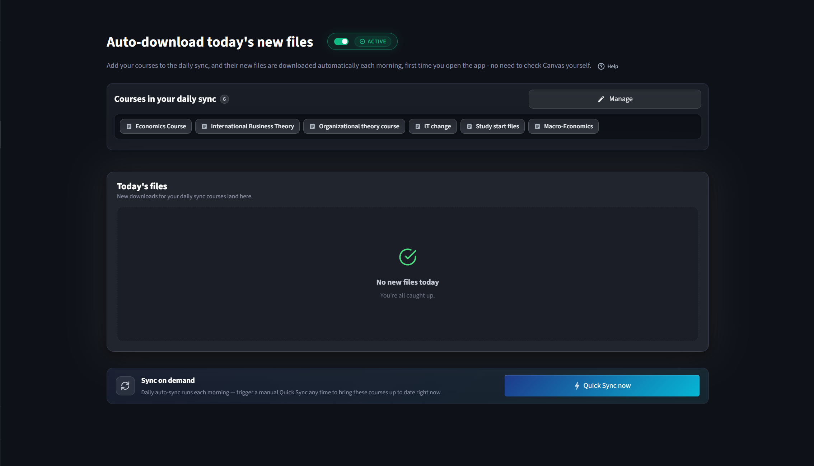

<div align="center">


# Canvas Downloader

### Download all your Canvas files at once, then let the folder keep itself up to date.

A free, open source desktop app for **Canvas** (Canvas LMS). Batch-download every file from every
course, back up a whole semester before you lose access, and let it auto-download new course files
each day. It saves **Panopto** lecture recordings with transcription that runs on your own machine,
and converts everything into AI-ready study material for **NotebookLM**, ChatGPT and Claude.
Windows and macOS. No cloud, no account, no telemetry.

Built to be opened every day of a degree, not once at the end of it.

[](https://github.com/BrkBuilds/Canvas-Downloader/releases/latest)
[](https://github.com/BrkBuilds/Canvas-Downloader/releases)
[](https://apps.microsoft.com/detail/9n1dwwvrq5wc)
[](#download)
[](LICENSE)

**[Download](#download)** · **[Website](https://canvasdownloader.app/)** · **[How it works](https://canvasdownloader.app/guide.html)** · **[Mac setup guide](https://canvasdownloader.app/mac-setup.html)** · **[FAQ](#faq)**

</div>

---

## Contents

- [What it does](#what-it-does)
- [At a glance](#at-a-glance)
- [Who it is for](#who-it-is-for)
- [Download](#download)
- [Screenshots](#screenshots)
- [Features](#features)
- [How it compares](#how-it-compares)
- [Quick start](#quick-start)
- [Backup, end of semester and graduation](#backup-end-of-semester-and-graduation)
- [FAQ](#faq)
- [Privacy and security](#privacy-and-security)
- [Architecture](#architecture)
- [Tech stack](#tech-stack)
- [Building from source](#building-from-source)
- [Contributing](#contributing)
- [Disclaimer and acceptable use](#disclaimer-and-acceptable-use)

---

## What it does

Canvas Downloader is a **standalone desktop application** that connects to your university's Canvas
through the official Canvas API and downloads every file from every course you select. No browser
extension, no web scraping, no cloud middleman, no account to create. It signs in as you, with your
own Canvas access token, and runs entirely on your own machine.

Five things it does that downloading by hand cannot:

**Batch download entire courses.** Select any combination of courses and pull everything in one run
- module files, assignments, syllabi, announcements, discussions, quizzes and your own submission
feedback. Files land in the same folder structure Canvas uses, or flat, whichever you pick.

**Keep folders up to date by itself.** The sync engine tracks exactly what changed since your last
run - new files, updated slide decks, teacher edits - and touches only what needs updating. It never
overwrites a file you edited and never resurrects a file you deleted. Turn on the **Today page** and
it syncs your chosen courses on its own the first time you open the app each day.

**Save Panopto lecture recordings.** The app finds the Panopto recordings linked in your courses and
saves them as video or audio, and can generate **transcripts and subtitles** with speech recognition
that runs on your own computer. Nothing is uploaded anywhere. Please read the
[disclaimer](DISCLAIMER.md) before enabling lecture downloads.

**Turn downloads into AI-ready study material.** One toggle converts every PowerPoint, Word
document, spreadsheet, video, web page and code file into a format NotebookLM, ChatGPT or Claude can
read and reason over.

**Back up a course, a semester or a whole degree.** Canvas zips one course's Files tab at a time,
and its own offline export refuses to run once a course has been concluded, which is usually the
moment people go looking for it. Tick every course you have ever taken, press Start once, and the
copy you keep includes the categories no Canvas export contains: assignment briefs, announcements,
discussions, quizzes and the feedback you were given.

---

## At a glance

| | |
|---|---|
| **What it is** | A desktop app that batch-downloads Canvas course material, then keeps the folder in sync |
| **Price** | Free and open source, GPL-3.0. No premium tier, no ads, no account |
| **Platforms** | Windows 10/11, and macOS 14+ on Apple Silicon |
| **Sign-in** | Your own Canvas access token, stored in the OS keyring. No Canvas password, no account with us |
| **What it can reach** | Only what your own Canvas account can already open. It breaks no copy protection |
| **Where your data goes** | Nowhere. No backend, no analytics, no telemetry, nothing uploaded |
| **Lecture recordings** | Panopto, as video, audio, transcript or subtitles, transcribed on your own machine |
| **AI tools** | Converts on the way down, so a course folder drags straight into NotebookLM, ChatGPT or Claude |
| **Affiliation** | Not affiliated with Instructure, Canvas or Panopto |

---

## Who it is for

A university student who uses Canvas, on Windows or a Mac, who would rather have the material on
their own disk than three clicks deep inside a course page. Students arrive at it at one of four
moments:

- **"Downloading these one at a time is absurd."** Mid-semester. Slides go up twice a week, across
  five courses, and Canvas will zip one course's Files tab at a time. This is the biggest group and
  it is what the app was built for.
- **"I need everything before I lose access."** A course is concluding, or you are graduating. The
  deadline is not one date but three, and the first one can pass while you are still enrolled. See
  [Backup, end of semester and graduation](#backup-end-of-semester-and-graduation).
- **"I want my course inside an AI tool."** NotebookLM, ChatGPT and Claude do not accept `.pptx`,
  `.doc` or the HTML Canvas exports its Pages as. The app converts as it downloads, so the folder is
  drag-and-drop ready when it lands.
- **"I want the lecture recordings."** Panopto, as video, as audio, or as a transcript produced on
  your own machine.

**It is a desktop app, and that is the whole design.** An installed app can remember what it did
last time, run on a schedule, and drive software already on your machine. That is what makes sync,
daily auto-download and file conversion possible at all, and it is why a browser extension or a
terminal script cannot do those three things. It is meant to sit on your machine for a degree, not
to be run once and uninstalled.

---

## Download

No Python installation required. Everything is bundled.

| Platform | Get it | Requirements |
|---|---|---|
| **Windows 10/11** | **[Microsoft Store](https://apps.microsoft.com/detail/9n1dwwvrq5wc)** (recommended - auto-updates, no security warning)<br>or the `.exe` installer from **[Releases](https://github.com/BrkBuilds/Canvas-Downloader/releases/latest)** | Nothing, batteries included |
| **macOS 14+** | `Canvas_Downloader_macOS.dmg` from **[Releases](https://github.com/BrkBuilds/Canvas-Downloader/releases/latest)** | **Apple Silicon only** (M1 or later). Intel Macs are not supported |

### Windows

1. Install from the **Microsoft Store**, or run the `.exe` installer from Releases.
2. If you used the direct installer, Windows SmartScreen will warn you. Click **More info**, then
   **Run anyway**.
3. Launch **Canvas Downloader**.

> **Why the SmartScreen warning?** Code-signing certificates cost hundreds of dollars per year. This
> is a free student project, so the direct installer is unsigned. The Microsoft Store build has no
> warning, and the full source is public in this repository.

### macOS

1. Open the `.dmg` and drag **Canvas Downloader** to your Applications folder.
2. First launch:
   - **macOS 14:** right-click the app, choose **Open**, then **Open** again.
   - **macOS 15 (Sequoia) and newer:** double-click it, let it get blocked, then go to
     **System Settings → Privacy & Security**, scroll down and click **Open Anyway**. Sequoia removed
     the old right-click bypass, so this is the only route.
3. Follow the **[interactive Mac setup guide](https://canvasdownloader.app/mac-setup.html)**. It walks
   through every permission dialog for your exact macOS version.

<details>
<summary><b>What macOS will ask you on first run (this is normal)</b></summary>

<br>

Because the app is free and unsigned, macOS asks for each permission separately. Each prompt appears
once, with one exception noted below.

| Prompt | Why it appears | What to click |
|---|---|---|
| *"Canvas Downloader" was blocked* | The app is not signed with a paid Apple certificate | **Open Anyway**, in Privacy & Security |
| *wants to access key "CanvasDownloader" in your keychain* | Saves your Canvas token securely in the macOS Keychain | **Always Allow**, then enter your **Mac login password** (not your Canvas token) |
| *wants access to files in your Downloads/Documents folder* | Saves your course files where you chose | **OK** or **Allow** |
| *wants access to control "Microsoft PowerPoint"* (or Word, Excel) | Converts slides and documents to PDF for you | **OK** |
| *wants to access data from other apps* (macOS 15+) | Office to PDF conversion stages files between apps | **Allow**, or grant **Full Disk Access** once to silence it permanently. The app's Settings page has a status card for this |

After **updating** to a new version, macOS treats it as a new app and the Keychain prompt appears
once more. Click **Always Allow**. Your saved login is intact.

**Uninstalling:** log out inside the app first (this removes your token from the Keychain), drag the
app to the Trash, and optionally delete `~/Library/Application Support/CanvasDownloader`.

</details>

---

## Screenshots

<table>
  <tr>
    <td width="50%" valign="top"><br><sub><b>Find your school.</b> 4,757 Canvas institutions, searchable - no need to know your URL.</sub></td>
    <td width="50%" valign="top"><br><sub><b>Watch it run.</b> Live speed, ETA, and a log of every file.</sub></td>
  </tr>
  <tr>
    <td width="50%" valign="top"><br><sub><b>Pick your courses.</b> Search, filter and select as many as you like.</sub></td>
    <td width="50%" valign="top"><br><sub><b>Quick Download.</b> Five ready-made presets, one click.</sub></td>
  </tr>
  <tr>
    <td width="50%" valign="top"><br><sub><b>Or configure everything.</b> Files, Canvas content, AI conversions, Panopto recordings.</sub></td>
    <td width="50%" valign="top"><br><sub><b>Review every change.</b> New, updated, edited locally, deleted - you decide, file by file.</sub></td>
  </tr>
  <tr>
    <td width="50%" valign="top"><br><sub><b>Link folders to courses.</b> Then keep them current without downloading it all again.</sub></td>
    <td width="50%" valign="top"><br><sub><b>Today.</b> Flip one toggle and your courses sync themselves each morning.</sub></td>
  </tr>
</table>

> Short demo clips for each mode are on the **[website](https://canvasdownloader.app/)**.

---

## Features

### Three modes, and which one you want

| Mode | For | In one line |
|---|---|---|
| **Download** | The first run, or a full backup | Tick courses, choose what to include, get everything in one pass |
| **Sync** | The rest of the semester | Compares your folder against Canvas and fetches only what is new or changed |
| **Today** | Every day, without thinking about it | Auto-downloads new Canvas files the first time you open the app each day |

A download is a snapshot: run it, get a folder, and the folder is out of date the next time your
lecturer uploads something. A sync is the same courses kept current, which needs a record of what
happened last time - which is exactly what a popup or a one-off script has nowhere to put. Today is
Sync mode running by itself.

### Mode 1: Download - every file from every course, in one run

- **Multi-course batch download** - select any combination of courses and pull everything in one run
- **Canvas structure preserved** - files land in the same folder hierarchy Canvas uses, or flat
- **Parallel downloads** - `asyncio` and `aiohttp` with configurable concurrency (1 to 15), with
  Canvas rate-limit backoff built in
- **Atomic writes** - `.part` staging, so a crash mid-download never leaves a corrupted file
- **File size filters** - skip the large videos you do not need right now. Skipped files are marked
  *ignored* in the sync manifest so future runs stop listing them, and you can restore them at any
  time from the ignored-files list
- **Full Canvas content** - module files, assignments, syllabi, announcements, discussions, quizzes,
  and your own submission feedback and grades

### Quick Download - five ready-made presets

Skip configuration entirely. Pick a preset, pick a folder, press Start.

| Preset | What it does |
|---|---|
| **Complete Canvas Download** | Everything. All files and Canvas content, organised exactly like Canvas, plus full Panopto lecture videos |
| **Daily study pack** | Same as Complete, plus PowerPoint and Word to PDF conversion, and Panopto video and audio |
| **100% AI and NotebookLM ready** | Every file in one flat folder, every conversion enabled, lecture audio in a Recordings folder. Drag straight into NotebookLM |
| **Slides and PDFs only** | Lecture slides and PDF documents, nothing else |
| **Files only** | Only teacher-uploaded files. No Canvas web content, no recordings |

Or use **Custom Download** for control over every individual setting.

### Mode 2: Sync - keep a folder current all semester

Keep any folder **permanently in sync** with its Canvas course. One click pulls every new lecture,
updated slide deck and freshly posted file since your last run. The engine tracks seven distinct
file states:

| State | What it means | Default action |
|---|---|---|
| **New** | Canvas has it, you do not | Download |
| **Update (clean)** | Canvas updated it, your copy is untouched | Replace in place |
| **Update (modified)** | Canvas updated it, but you edited yours | Keep yours, save the new one as `_NewVersion` |
| **Deleted locally** | You deleted it, Canvas still has it | Skip, your intent is respected |
| **Deleted on Canvas** | The teacher removed it | Shown for information only. Never deletes from your disk |
| **Up to date** | Identical on both sides | Nothing, shown as a count |
| **Ignored** | Permanently excluded by you | Always skip |

Change detection uses **MD5 fingerprinting** stored in a per-folder SQLite manifest
(`.canvas_sync.db`, hidden alongside your files). Renamed files are matched with **Levenshtein
distance**, so a lecturer renaming `Lecture 3.pdf` to `Lecture 03 - Updated.pdf` is recognised as
the same file instead of downloading a second copy. Panopto recordings take part in sync as
first-class files.

Two ways to run it:

- **Quick Sync** - one click. Downloads new files and clean updates, skips everything else.
- **Analyze, Review & Sync** - a full per-file diff across all seven states, with bulk selection,
  extension filters and per-file ignore or restore.

### Mode 3: Today - auto-download new Canvas files every day

A daily dashboard built around one idea: you should not have to think about syncing at all.

- **Daily auto-sync** - pick your courses once, flip a toggle, and the app runs a Quick Sync by
  itself the first time you open it each day. The day rolls over at 4 AM, so a late-night session
  does not count as tomorrow
- **Today's files** - everything that arrived today, grouped per course, with one-click open file
  and open folder
- **Quick Sync now** - the same curated set, on demand
- Same guarantees as any sync: never overwrites your edits, never resurrects your deletions

### Panopto lecture recordings

Courses that publish recordings through **Panopto** are fully supported. The app discovers every
recording linked in your Canvas course using per-item LTI launches, so even deeply nested folders
are found, then works in three clear phases: **discover, download, transcribe**.

Per recording you can save any combination of:

| Output | Format | Setup needed |
|---|---|---|
| **Shortcut** | `.url` (Windows) / `.webloc` (macOS) - opens the lecture on Panopto | None |
| **Video** | `.mp4`, stream remux with no re-encode | None |
| **Audio** | `.mp3` | None |
| **Transcript** | `.txt` | One-time local model download |
| **Subtitles** | `.srt`, timestamped | One-time local model download |

The **Shortcut** output costs no bandwidth, no disk space and no time, and it answers what a
transcript cannot: take me back to the lecture, with the slides, the screen capture and Panopto's
own search still attached. It is a pointer, so it stops working when your Canvas access ends, which
is exactly when people want the offline copy - treat it as a companion to a download, not a
replacement.

Transcription runs **entirely on your own computer** through
[faster-whisper](https://github.com/SYSTRAN/faster-whisper). Choose the model size and the spoken
language (Danish, English, German, auto-detect and more). CPU works everywhere. On Windows with an
NVIDIA GPU the app can enable CUDA acceleration through a one-click download of about 1.3 GB, with
no admin rights needed. Each transcription runs in an isolated subprocess, so even a GPU driver
crash cannot take down the app - it falls back to CPU and carries on.

Recordings are sized before download so disk-space checks include them, can be ignored individually,
and sync like any other file. Panopto support can be switched **off completely** in Settings: no
institution lookup, no discovery, no acceptable-use dialog and no recordings in any download or
sync.

### AI optimization - NotebookLM ready in one click

Enable one toggle and every download is converted into a format an AI tool can ingest directly.

| Source | Output | Engine |
|---|---|---|
| `.pptx` `.ppt` | `.pdf` | COM automation (Windows) / AppleScript (macOS) |
| `.doc` `.rtf` `.odt` legacy Word | `.pdf`, modern `.docx` untouched | COM automation / AppleScript |
| `.xlsx` `.xlsm` | `.pdf` plus `_Data.txt` structured data | openpyxl for data, COM or AppleScript for PDF |
| `.xls` legacy | `.pdf` only | COM automation / AppleScript |
| `.mp4` `.mov` `.avi` `.mkv` `.webm` and 15 more | `.mp3` | FFmpeg through MoviePy |
| `.html` Canvas pages | `.md` or plain text | BeautifulSoup and markdownify |
| `.zip` `.tar` `.tar.gz` | extracted | Python stdlib, with zip-bomb protection |
| 50+ code extensions | `.py.txt`, `.js.txt` and so on | UTF-8 native |
| External web links | one `.txt` per course | native |

The Excel data sidecar is worth calling out. `Financials_Data.txt` contains every sheet in CSV form
with a cell coordinate grid (A1, B2 and so on) matching the companion PDF, formula annotations such
as `250 [Formula: =B2*C2]`, merged cell values repeated across the full merged range, and hidden row
and column markers. An AI tool can cross-reference the visual PDF against precise cell data and
understand the formulas underneath, which is far more useful than parsing the PDF alone.

**Note:** the data sidecar is generated for modern Excel formats only (`.xlsx`, `.xlsm`). Legacy
`.xls` files are converted to PDF only, because the extraction engine (openpyxl) does not read the
binary `.xls` format.

Safety details: archives enforce a **50 GB uncompressed limit** and a **100:1 compression ratio
guard**. Every converter that deletes the file it converted from verifies the output is real first -
present, non-empty and structurally valid - so a failed conversion can never destroy your only copy.
Conversions that need Microsoft Office are skipped gracefully, keeping the original, when Office is
not installed.

### Signing in

A searchable directory of **4,757 verified Canvas institutions** sits next to the URL field on the
login screen. Find your university, and its Canvas address fills itself in. The field stays fully
editable, so this is a shortcut and never a gate - every Canvas school works whether or not it is
listed, and the picker opens on the institutions in your own country.

Your access token is stored in your operating system's keyring (Windows Credential Manager, macOS
Keychain) and never written to disk in plain text.

### Presets, progress and history

- **Presets** - save a complete configuration (courses, content types, conversions, Panopto outputs,
  output folder) under a name and recall it in one click. Stored as plain JSON, so they move between
  machines
- **Live dashboard** - per-course file counts, MB transferred, transfer speed and a time-remaining
  estimate that learns as the run goes
- **Per-phase Panopto progress** - discovery, download and transcription reported separately
- **Terminal-style log** with colour-coded status lines
- **Cancel at any point** - mid-download, mid-conversion or mid-transcription
- **System notification and a chime** when a run finishes
- **Sync history** - a browsable log of past runs, retention configurable from 10 to 500 entries
- **Exportable error log** for any file that failed

---

## How it compares

There are four ways to get a Canvas course onto your computer: Canvas's own **Download as Zip**, a
**browser extension**, a **script**, or a **desktop app**. The shape decides more than any feature
list does, because the shape decides how long the tool is around. This section is written by the
person who built one of them, so every row is checkable, and the losses are two tables down. The
long version, with links into each project's own documentation, is
[Canvas download tools compared](https://canvasdownloader.app/canvas-download-tools-compared.html).

| What you want | Download as Zip | Browser extension | Script | Canvas Downloader |
|---|---|---|---|---|
| Nothing to install | Yes | An add-on | No | No |
| No access token needed | Yes | Yes | No | No |
| No terminal, no code | Yes | Yes | No | Yes |
| Several courses in one run | No | Yes | Varies | Yes |
| Pages, assignments, announcements | No | Yes | Varies | Yes |
| The feedback and grades you were given | No | No | Varies | Yes |
| Shows you what changed before it downloads | No | No | No | Yes |
| Fetches new material on its own each day | No | No | If you script it | Yes |
| Leaves the copies you annotated alone | n/a | No | No | Yes |
| Converts as it downloads, ready for AI tools | No | No | No | Yes |
| Panopto lecture recordings | No | Some, one at a time | No | Yes, every course at once |
| Transcribes a recording that has no captions | No | No | No | Yes, on your machine |
| Cost | Free | Usually free | Free | Free and open source |

Checked August 2026 against each project's own documentation.

**Canvas's own Download as Zip is better than its reputation, and the gap is not where people
think.** Measured across 33 real Canvas courses at one university: where the Files tab worked, the
zip missed 3 files out of 358. But in 3 of the 11 courses that held material, Canvas refused the
Files listing entirely, and those courses held 246 files. And 173 items in the same sample were not
files at all - Pages, assignment briefs, announcements, discussions, quizzes, feedback - so no zip
of any kind contains them. Method and numbers:
[what Canvas's Download as Zip actually misses](https://canvasdownloader.app/what-canvas-download-as-zip-misses.html).

### The specific alternatives, and where each one wins

| Tool | Where it beats this app | Where this app is ahead |
|---|---|---|
| **Canvas's own Download as Zip** | Nothing to install, no token, already in front of you | One course at a time, files only, and Canvas's offline export refuses to run once a course is concluded |
| **[jasp-nerd/canvas-course-downloader](https://github.com/jasp-nerd/canvas-course-downloader)**, a browser extension | **No access token at all** - it rides the Canvas session you already have. Zero setup, several courses, and it skips files it fetched before | Its own README rules out content hosted by third-party LTI tools, so no Panopto. No conversion, no protection for files you edited, and Pages arrive as HTML summaries |
| **[davekats/canvas-student-data-export](https://github.com/davekats/canvas-student-data-export)**, a script | Far more established, and endlessly flexible if a terminal is somewhere you are comfortable | Needs Python, a credentials file and a token. Its own notes say it cannot capture quiz data, and the maintenance is yours when Canvas changes something |
| **Panopto caption and video extensions** | Simpler for one recording you are already looking at | Per video, and manual. They export a caption Panopto already made; this app finds every recording across every ticked course and transcribes locally when no caption exists |

### When another tool is the better answer

- **One course, today, nothing installed:** Canvas's own **Download as Zip**.
- **Your institution has switched off student access tokens:** a browser extension is your only
  option, because every API tool is closed to you. Worth checking before you install anything.
- **A tidy archive of a few courses, without installing a desktop app:** a browser extension. No
  token to renew, and it will cover most of what you want.
- **You can write code and want it exactly your way:** a script built on `canvasapi`.
- **You will be doing this all semester, or all degree:** that is the case this app was built for,
  and the one the other shapes were not built for.

### Where this app loses

- It needs an **access token**, which an extension does not, and Canvas keeps making tokens
  shorter-lived. Some institutions disable them for students entirely.
- The install is a **few hundred megabytes** against an extension's few hundred kilobytes.
- It ships **unsigned** outside the Microsoft Store, so Windows and macOS both warn you the first
  time you open it.
- **Office conversions need Microsoft Office installed.** Without it those files are kept exactly as
  they are rather than converted.
- It is the **newest and least proven** of the tools listed here.

---

## Quick start

### 1. Get your Canvas access token

1. Log in to your institution's Canvas, then go to **Account → Settings**.
2. Scroll to **Approved Integrations** and click **+ New Access Token**.
3. Give it a name. No expiry date is needed. Copy the token.

You can revoke it from the same page at any time.

### 2. Download your courses

**First time, the fast path:**

1. Launch Canvas Downloader, find your university in the institution picker, and paste your token.
2. Select your courses, press **Quick Download**, pick one of the five presets and choose a folder.
3. Watch the live dashboard. A chime plays when it is done.

**Full control:** use **Custom Download** to configure everything yourself across four cards - file
filter and folder structure, Canvas content, AI conversions and Panopto recordings. Save it as a
preset for next time.

### 3. Keep it up to date

1. Switch to **Sync Mode** in the sidebar.
2. Create a sync pair: pick a folder and link it to a Canvas course. Save pairs and multi-course
   groups in the hub for one-click reuse.
3. Use **Quick Sync** for the fast path, or **Analyze, Review & Sync** for the full per-file review.

### 4. Put it on autopilot

Open the **Today** page, import your pairs and turn on daily sync. From then on, the first launch of
each day fetches everything new and lists today's files per course.

---

## Backup, end of semester and graduation

The deadline is not one date. It is three, they belong to different systems, and they close in
roughly the reverse of the order you would want.

1. **The lecture recordings go first.** Panopto is a separate system with its own retention rules,
   usually tied to the teaching term rather than to your enrolment. Stanford tells staff that
   viewers lose access to course recordings "typically the Sunday after grades are due". The same
   university gives graduating students 120 days of Canvas. Days against months, for two halves of
   the same course.
2. **The course concludes.** It goes read-only, and Canvas's own offline export,
   **Modules → Export Course Content**, will not run any more. The tool built to back a course up
   has a shorter life than the course. Conclusion is tied to the course rather than to you, so a
   first-year module can close behind you while you are three years from graduating.
3. **Your enrolment or your account ends.** Everything goes at once, including any access token you
   created for a downloading tool.

**How long do you have?** Your university decides, not Instructure, and the published range is
wide: **120 days** at Stanford, **365 days** after the semester at Washington University, **five
years** of course-site retention at Penn. Assume less time than you think.

**What to save, in the order the doors close.** Lecture recordings first, because they expire
soonest and take longest to fetch. Then quiz descriptions and the feedback on your work, neither of
which appears in any Canvas export. Then Pages, announcements and discussions. Files last, because
files are the best-protected category on the list.

**Doing it for a whole degree.** Tick every course in the list, choose the **Complete Canvas
Download** preset, pick a folder, and leave it running. Selecting takes a couple of minutes and the
run is unattended. Do it while the courses are still open, not after.

Full detail, with sources:
[how to back up a Canvas course before you lose access](https://canvasdownloader.app/back-up-canvas-course-before-losing-access.html) ·
[the end-of-semester Canvas checklist](https://canvasdownloader.app/canvas-end-of-semester-checklist.html) ·
[Canvas access after graduation](https://canvasdownloader.app/canvas-access-after-graduation.html)

---

## FAQ

### Downloading, syncing and backing up

<details>
<summary><b>How do I download all the files from a Canvas course at once?</b></summary>

Canvas can zip one course's Files tab at a time, and only what lives in that tab. This app takes any
number of courses in one run and adds the categories Canvas has no bulk export for: assignment
briefs, the syllabus, announcements, discussions, quizzes and the feedback you were given. Pick a
preset, pick a folder, press Start. All five built-in Canvas routes are compared on the website in
[how to download all files from Canvas](https://canvasdownloader.app/how-to-download-all-canvas-files.html).

</details>

<details>
<summary><b>Can I download all of my Canvas courses at once, not just one?</b></summary>

Yes. Select as many courses as you like in a single run - a semester, a year, or every course you
have ever been enrolled in. Each course gets its own folder, laid out the way Canvas lays it out, or
flat if you prefer. Choosing the courses takes a couple of minutes and the run itself is unattended.

</details>

<details>
<summary><b>Can I back up my Canvas courses before I lose access?</b></summary>

That is what most people install it for. Tick every course, choose the **Complete Canvas Download**
preset and pick a folder. Do it while the courses are still open: Canvas's own offline export
refuses to run once a course has been concluded, and lecture recordings usually disappear before
your login does. The order to save things in is under
[Backup, end of semester and graduation](#backup-end-of-semester-and-graduation).

</details>

<details>
<summary><b>How long do I have access to Canvas after I graduate?</b></summary>

Your university decides this, not Instructure, and the published range is wide: 120 days at
Stanford, 365 days after the semester at Washington University, five years of course-site retention
at Penn. Access also ends in three separate ways - the course concludes, your enrolment ends, or
your account is deactivated - and the first can happen while you are still a student. The full
answer, with sources, is
[Canvas access after graduation](https://canvasdownloader.app/canvas-access-after-graduation.html).

</details>

<details>
<summary><b>Does it still work after a course has ended?</b></summary>

Yes, for as long as you can still open the course in Canvas. A concluded course is read-only rather
than gone, and the API still serves what you can see. What stops working at that point is Canvas's
own **Export Course Content** button, which refuses to run on a concluded course. When your
enrolment ends, everything stops, including your access token.

</details>

<details>
<summary><b>Can it download new Canvas files automatically every day?</b></summary>

Yes, that is the **Today** page. Pick your courses once, switch on daily sync, and the first time
you open the app each day it fetches everything new from those courses on its own and lists what
arrived, grouped per course. The day rolls over at 4 AM, so a late-night session does not count as
tomorrow. It is a desktop app rather than a background service, so it runs when you open it, not
while your machine is asleep.

</details>

<details>
<summary><b>What is the difference between Download mode and Sync mode?</b></summary>

A download is a snapshot: you run it, you get a folder, and the folder is out of date the next time
your lecturer uploads something. A sync compares the folder on your disk against the course on
Canvas and fetches only the difference, which is also what lets it show you what changed, skip files
you have edited, and run on a schedule. Use Download mode for the first run or a full backup, and
Sync mode for the rest of the semester.

</details>

<details>
<summary><b>Will it download everything again every time?</b></summary>

No. Every file is fingerprinted with MD5 in a hidden per-folder SQLite manifest, so a sync fetches
only what is new or genuinely changed. A file your lecturer renamed is matched by similarity rather
than downloaded a second time, and files you told it to ignore stay ignored.

</details>

<details>
<summary><b>Can I download Canvas quizzes, Pages, discussions and announcements?</b></summary>

Yes, as readable files, one per item. None of that is a file inside Canvas, so no file download of
any kind reaches it. One honest limit on quizzes: **Canvas serves quiz questions to teachers only**,
so a student download saves the quiz's title, instructions and description and then says plainly
that the questions could not be served, rather than saving a file that looks empty.

</details>

<details>
<summary><b>Can I save the feedback and grades I was given?</b></summary>

Yes. **Submissions** saves the grade, the rubric assessment, your teacher's written comments and any
file the teacher attached, per assignment. Canvas's own submissions export hands back the files you
uploaded and nothing that was said about them, which is the wrong half. It reads only; it never
uploads or changes anything, and your instructor is not notified.

</details>

<details>
<summary><b>How do I get my Canvas files into NotebookLM?</b></summary>

Turn on the AI conversions, or pick the **100% AI and NotebookLM ready** preset, and the folder is
drag-and-drop ready when it lands: PowerPoint and Word become PDF, Canvas Pages become Markdown,
code files become plain text, lecture video becomes audio. NotebookLM does not accept `.pptx`,
`.doc` or Canvas's exported HTML, and neither do ChatGPT or Claude. There is a full breakdown of
what each tool takes in
[getting Canvas files into NotebookLM](https://canvasdownloader.app/canvas-files-into-notebooklm.html).

</details>

<details>
<summary><b>Can it download Panopto lecture recordings and transcripts?</b></summary>

Yes. It finds every recording linked in the courses you ticked, without you having to know where
they are, and saves any combination of MP4 video, MP3 audio, a `.txt` transcript, `.srt` subtitles,
and a shortcut back to the lecture. Transcription runs on your own machine, so it also works when
Panopto never produced a caption. Please read the permission question below, and the
[disclaimer](DISCLAIMER.md), before enabling it.

</details>

<details>
<summary><b>How is this different from Canvas's Download as Zip?</b></summary>

Download as Zip is one course, files only. It is better than its reputation: measured across 33 real
Canvas courses, it missed 3 files out of 358 wherever the Files tab worked. The gaps are elsewhere.
In 3 of the 11 courses holding material, Canvas refused the Files listing entirely, and those held
246 files. And 173 items in the sample were not files at all, so no zip contains them. Full method:
[what Canvas's Download as Zip actually misses](https://canvasdownloader.app/what-canvas-download-as-zip-misses.html).

</details>

<details>
<summary><b>Where do I find my university's Canvas URL?</b></summary>

The login screen has a searchable directory of 4,757 verified Canvas institutions, so you can type
your university's name instead of its address. There is a crawlable copy on the website at
[the Canvas URL directory](https://canvasdownloader.app/canvas-url-directory.html), and the same
data as an open dataset under CC BY 4.0. Any Canvas address works whether or not it is on the list.

</details>

<details>
<summary><b>Is it really free? What is the catch?</b></summary>

It is free and GPL-3.0 licensed. No premium tier, no ads, no account, no trial. There is no server
to pay for, because there is no server: the app talks to your university's Canvas from your own
machine and to nothing else. The nearest thing to a catch is that the direct installer is unsigned,
so you click through one warning the first time, and that the Windows and macOS builds are a few
hundred megabytes because everything is bundled.

</details>

<details>
<summary><b>Will it overwrite work I have edited?</b></summary>

No. If Canvas has a newer version of a file you have edited locally, your copy is kept and the new
version is saved alongside it with a `_NewVersion` suffix. The same protection covers files the app
converted for you, such as a PDF made from a slide deck.

Files you deleted on purpose are not downloaded again, and files removed from Canvas are never
deleted from your disk.

</details>

### Permission, privacy and safety

<details>
<summary><b>Is this allowed? Will my university know?</b></summary>

The app uses the official Canvas API with an access token you create yourself, which is a documented
and supported Canvas feature. It can only reach material your own account is already permitted to
open, and it downloads the same files you could save one by one from your browser.

Canvas does log API activity the same way it logs normal use. Nothing is hidden from your
institution, and nothing pretends to be a different user.

Lecture recordings are a separate question, so please read the next answer and the
[full disclaimer](DISCLAIMER.md).

</details>

<details>
<summary><b>What about Panopto lecture recordings specifically?</b></summary>

Panopto has a download button your institution can switch on or off for each recording. **This app
does not read that setting**, so saving a recording may still be against your institution's rules
even when the app succeeds.

Recordings belong to your lecturer and your institution. Keep them for your own study, and never
share or republish them. Panopto support is off by default and can be switched off entirely in
Settings.

</details>

<details>
<summary><b>Is my Canvas token safe?</b></summary>

It is stored in your operating system's credential store - Windows Credential Manager or the macOS
Keychain - and never written to disk in plain text. On Windows, if the keyring is unavailable, an
encrypted DPAPI fallback file is used, whose ciphertext is bound to your Windows user account.
macOS deliberately has no disk fallback.

The app has no backend and no accounts. Your token never leaves your machine except to talk to your
own university's Canvas. You can revoke it from Canvas at any time.

</details>

<details>
<summary><b>Does transcription send my lectures to a server?</b></summary>

No. Speech recognition runs on your own computer through faster-whisper. The only thing downloaded
is the model itself, once, from Hugging Face. Audio never leaves your machine.

</details>

<details>
<summary><b>Can I use it on a shared or lab computer?</b></summary>

It is better not to. The app signs in automatically from your keyring, and a local server on
`127.0.0.1` is reachable by other users signed in to the same machine at the same time. Prefer your
own device.

</details>

### Installing and running

<details>
<summary><b>Does it work with my university?</b></summary>

If your university uses Canvas, yes. The app talks to the standard Canvas API, not to anything
institution-specific. The login screen lists 4,757 verified Canvas institutions to save you typing
the address, but that list is only a convenience - schools not on it work exactly the same way once
you paste your Canvas URL.

</details>

<details>
<summary><b>Do I need Python or any other install?</b></summary>

No. The Windows and macOS builds bundle everything, including FFmpeg. Python is only needed if you
want to run from source.

</details>

<details>
<summary><b>Why does Windows or macOS warn me about the app?</b></summary>

Code-signing certificates cost hundreds of dollars a year and this is a free project, so the direct
downloads are unsigned. The **Microsoft Store** build is signed and shows no warning. On macOS,
follow the [setup guide](https://canvasdownloader.app/mac-setup.html) for your version. All the
source is in this repository if you would rather build it yourself.

</details>

<details>
<summary><b>Does it work on an Intel Mac?</b></summary>

No. The macOS build is Apple Silicon only (M1 or later). Running from source on an Intel Mac may
work but is not tested or supported.

</details>

---

## Privacy and security

- **No backend, no accounts, no analytics, no telemetry.** There is no server to send anything to.
- The app talks to exactly two kinds of servers: **your university's Canvas**, and, only if you turn
  on lecture downloads, **your university's Panopto**. The only other network calls are optional
  one-time downloads - a transcription model from Hugging Face, CUDA libraries from NVIDIA, and a
  version check against this repository's releases.
- Your **access token** lives in the OS keyring. See the FAQ above for the details.
- The local Streamlit server binds to **`127.0.0.1` only**, so nothing is exposed to your network.
  On a shared computer, other users signed in at the same time can reach localhost ports, so prefer
  a personal device.
- **Transcription is fully local.** Audio never leaves your machine.
- Archive extraction enforces a **50 GB uncompressed limit** and a **100:1 ratio guard** against zip
  bombs, and refuses any archive member that would escape the target folder.
- All Canvas data rendered into the UI is escaped before injection.
- Debug logs **redact** Bearer tokens and signed download-URL tokens before anything is written to
  disk.

---

## Architecture

Canvas Downloader is 82 Python modules (about 4.4 MB of source) covered by **4,521 tests**, in a
deliberately modular structure.

```text
start.py                     Cross-platform launcher
├── Streamlit server (127.0.0.1, daemonized thread)
└── pywebview window (main thread), WebView2 on Windows, Cocoa/WKWebView on macOS

app.py                       Download mode orchestrator and routing
sync_ui.py                   Sync mode orchestrator

ui/                          Streamlit UI components
  auth.py                    Sidebar: token auth, navigation, Settings
  institution_picker.py      Searchable directory of 4,757 Canvas institutions
  course_selector.py         Step 1: multi-select with search and filters
  download_settings.py       Step 2: file, content, AI and Panopto cards
  quick_download.py          Quick Download presets page
  today_dashboard.py         The Today page (daily auto-sync and today's files)
  presets.py                 Preset engine and hub modal
  hub_dialog.py              Saved Groups & Pairs hub
  sync_dialogs.py            Sync pair configuration
  sync_review.py             Per-file diff review screen
  sync_confirmation.py       Pre-execution confirmation
  panopto_page.py            Transcription model and GPU management
  update_banner.py           New-release notice

core/
  library.py                 The unified store: saved pairs, groups, daily membership
  library_migrate.py         One-time reversible migration of the legacy pair files
  pair_labels.py             Your own name for a (course, folder) link
  course_cache.py            Course list served from cache, refreshed off the render path
  state_registry.py          Single source of truth for session state keys and defaults
  cancellation.py            Global cancel flags and polling
  canvas_logic.py            Canvas API wrapper and async download engine
  sync_manager.py            SQLite manifest engine (Levenshtein collision resolution)
  preset_manager.py          Preset persistence
  auto_sync.py               Headless daily Quick Sync wrapper (Today page)
  today_store.py             Today page settings
  health_log.py              Session health record and orphan-process reaping

engine/
  progress_dashboard.py      Shared terminal log and visual dashboard
  estimation.py              Time-remaining model, one estimator for every phase
  post_processing_bridge.py  Unified post-processing init (download and sync share it)
  applescript_bridge.py      macOS osascript runner, shared by all Office converters
  notifications.py           Native notifications

sync/
  analysis.py                Diff engine: Canvas vs local, seven-state categorisation
  execution.py               Background async sync execution
  persistence.py             Atomic JSON (os.replace plus a lock)
  completion.py              Post-sync summary and history logging

panopto/                     Lecture recording pipeline
  discovery.py               Per-item LTI launches and folder walk
  runner.py                  discover, download, transcribe orchestration
  stream.py                  MP4/MP3 fetch (FFmpeg remux)
  shortcut.py                .url / .webloc link output
  transcribe.py              faster-whisper in an isolated subprocess
  transcribe_worker.py       The isolated worker process
  cuda_provision.py          On-demand NVIDIA CUDA library download
  models.py, hardware.py, settings.py, sync_plan.py, auth.py, institution.py

converters/                  File conversion pipeline
  post_processing.py         Unified pipeline runner
  verify.py                  Output gates: a source is deleted only if the product is real
  pdf.py, word.py, excel.py  Office to PDF and data
  code.py, md.py, url.py, video.py, archive.py

shared/                      Cross-cutting utilities
  helpers.py, components.py, theme.py, legal.py
  institutions.py            Generated verified Canvas institution list
  shortcuts.py               .url / .webloc format, shared by three consumers

styles/                      Static CSS injected via inject_css()
scripts/                     Build and maintenance tooling, not bundled in the app
tests/                       4,521 tests
```

### Notable engineering decisions

**Why Streamlit inside a desktop window?** Streamlit's reactive model makes a multi-step wizard UI
fast to build and easy to reason about. `pywebview` wraps it into a real desktop app on both
platforms, a WebView2 window on Windows and a native Cocoa/WKWebView window on macOS, with no
Electron and no Qt install.

**Why SQLite for sync state?** WAL mode gives concurrent-read safety, survives a crash mid-sync, and
the manifest travels with the folder. A JSON manifest would need locking on every write and has no
atomic transactions.

**How does cross-platform Office automation work?** Windows drives Word, Excel and PowerPoint as COM
servers through `win32com.client`. macOS uses AppleScript through a shared bridge. Both branches
implement identical semantics, so the calling code never checks the platform. COM instances are
self-healing: a stale or crashed instance is detected and restarted mid-batch, and on macOS the app
only quits an Office app it launched itself, so it can never close a document you were working on.

**What makes change detection reliable?** Files are fingerprinted with MD5 on first download and the
hash is stored in SQLite. Later syncs compare that hash against both the local file and the checksum
Canvas reports. Levenshtein matching handles teacher renames without downloading a second copy.

**How is transcription kept from destabilising the app?** Speech recognition runs in an isolated
subprocess per recording. A native crash in a GPU driver or inference runtime kills only that
worker. The app notices, downgrades to CPU and continues the batch. GPU users fetch CUDA libraries
on demand rather than everyone carrying a 1.3 GB heavier installer.

**How are Panopto recordings discovered reliably?** A generic LTI launch only sees the course's root
folder. The app performs per-module-item LTI 1.3 sessionless launches, so every embedded recording
is found, including ones whose embedded IDs have gone stale, which are healed by title matching.
Subfolders are then walked through Panopto's API with explicit depth and count bounds.

---

## Tech stack

| Layer | Technology |
|---|---|
| UI framework | [Streamlit 1.51](https://streamlit.io) |
| Desktop window | [pywebview 6.1](https://pywebview.flowrl.com), WebView2 on Windows, Cocoa WKWebView on macOS |
| Canvas API | [canvasapi 3.3](https://canvasapi.readthedocs.io) |
| Async HTTP | [aiohttp 3.11](https://docs.aiohttp.org) with asyncio |
| Async file I/O | [aiofiles 24.1](https://github.com/Tinche/aiofiles) |
| Sync database | SQLite3 (stdlib), WAL mode, one manifest per folder |
| Windows automation | [pywin32 308](https://github.com/mhammond/pywin32), COM interface to Office |
| macOS automation | `osascript` AppleScript, feature parity with COM |
| Speech recognition | [faster-whisper 1.2](https://github.com/SYSTRAN/faster-whisper) on CTranslate2, CPU everywhere, optional NVIDIA CUDA |
| Video processing | [MoviePy 2.2](https://zulko.github.io/moviepy/) with FFmpeg via imageio-ffmpeg |
| HTML to Markdown | [BeautifulSoup4 4.12](https://www.crummy.com/software/BeautifulSoup/) and [markdownify 0.14](https://github.com/matthewwithanm/python-markdownify) |
| Excel extraction | [openpyxl 3.1](https://openpyxl.readthedocs.io) |
| Credential storage | [keyring 25.6](https://github.com/jaraco/keyring) |
| Notifications | win11toast on Windows, UNUserNotificationCenter via pyobjc on macOS |
| Packaging | [PyInstaller](https://pyinstaller.org), Inno Setup for the Windows installer, MSIX for the Microsoft Store |

---

## Building from source

Requires Python 3.11 or newer.

```bash
git clone https://github.com/BrkBuilds/Canvas-Downloader.git
cd Canvas-Downloader

pip install -r requirements.txt

python start.py
```

Run the test suite:

```bash
python -m pytest
```

### Packaging

**Windows**, produces the Inno Setup installer:

```bash
python scripts/build_windows.py     # version_info, then PyInstaller, then Inno Setup
```

**Microsoft Store** (MSIX):

```bash
python scripts/build_msix.py
```

**macOS**, produces `Canvas Downloader.app` for Apple Silicon:

```bash
pyinstaller --clean Canvas_Downloader_macOS.spec
codesign --force --deep -s - --entitlements entitlements.mac.plist "Canvas Downloader.app"
```

The macOS spec includes the `com.apple.security.automation.apple-events` entitlement so AppleScript
Office automation works. Both specs apply a WebKit compatibility patch to Streamlit for older Safari
engines and inject the startup splash so the window is never blank.

---

## Contributing

Issues and pull requests are welcome. See **[CONTRIBUTING.md](CONTRIBUTING.md)** for how to set up a
development environment, what the test and audit workflow looks like, and the UI rules to follow.

If you found a security issue, please read **[SECURITY.md](SECURITY.md)** first rather than opening a
public issue.

`CLAUDE.md` in the repository root is the engineering logbook. It is long, and deliberately so -
every entry records a real failure, the measurement that found it and why the obvious fix was wrong.
Read the section relevant to whatever you are touching before you touch it.

---

## Disclaimer and acceptable use

Canvas Downloader saves a local copy of course material you already have access to. It signs in as
**you**, with **your** own Canvas access token, and can only reach what your account is already
permitted to open. It contains no decryption and breaks no copy protection. When Canvas or Panopto
refuses a request, the app reports the refusal and moves on.

**Lecture recordings:** Panopto has a download button your institution can switch on or off per
recording. **This app does not read that setting**, so saving a recording may still be against your
institution's rules. Recordings belong to your lecturer and your institution. Keep them for your own
study, and never share or republish them.

You are responsible for how you use this software, including compliance with your institution's IT
regulations, any applicable terms of service, and your local copyright law.

Full text: **[DISCLAIMER.md](DISCLAIMER.md)**. If you represent an institution or a rights holder and
have a concern, please open an issue or email **brkbuilds1@gmail.com** first. It will be addressed
promptly.

---

## License

Copyright (C) 2026 BrkBuilds

Canvas Downloader is free software: you can redistribute it and/or modify it under the terms of
the **GNU General Public License** as published by the Free Software Foundation, either version 3
of the License, or (at your option) any later version.

This program is distributed in the hope that it will be useful, but WITHOUT ANY WARRANTY; without
even the implied warranty of MERCHANTABILITY or FITNESS FOR A PARTICULAR PURPOSE. See the
[GNU General Public License](LICENSE) for the full terms.

In plain terms: use it, study it, share it and build on it freely. If you distribute a modified
version, the source has to come with it under this same license, so the next student can read and
fix it too.

Bundled third-party components and their licenses are listed in
[THIRD_PARTY_NOTICES.md](THIRD_PARTY_NOTICES.md).

---

<div align="center">

**[Download](https://github.com/BrkBuilds/Canvas-Downloader/releases/latest)** · **[Website](https://canvasdownloader.app/)** · **[Microsoft Store](https://apps.microsoft.com/detail/9n1dwwvrq5wc)**

If this saved you an afternoon of clicking, a star costs nothing and helps other students find it.

[](https://ko-fi.com/Z8Z01ZOY6Q)

<sub>Built with Python, Streamlit, and an unreasonable amount of CSS debugging.</sub>

</div>
