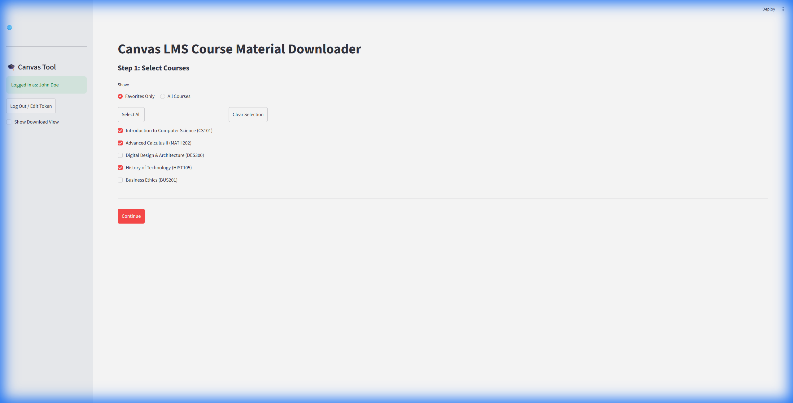
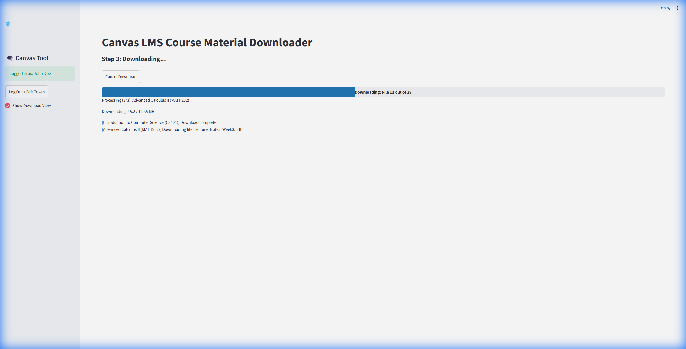

# Canvas Downloader

<p align="center">
  
</p>

This application allows students to batch download files and modules from Canvas LMS courses. It mirrors the exact module structure of your courses on your local drive, ensuring you have offline access to all your study materials.

<p align="center">
  
  
</p>

## Features

- **Save Hours of Clicking**: Download *all* files from a course in seconds. No more clicking "download" on every single PDF.
- **Stay Organized**: Automatically creates folders that match your Canvas Modules. Perfect for exam prep!
- **Offline Access**: Get all your materials on your hard drive so you can study without internet.
- **Downloads Everything**: Supports Files, Modules, Panopto Videos, Pages, and External Links.
- **Always Up-to-Date**: New courses added to your Canvas account appear automatically in the app.
- **Sync Mode**: Keep a local folder in sync with a Canvas course — only downloads what's new or changed.
- **Smart Post-Processing**: Optionally converts PowerPoint, Word, and Excel files to PDF, extracts video audio to MP3, and compiles external links for NotebookLM.
- **Study Mode**: Use the "PDF & PowerPoint only" filter to download only the most important study materials.
- **Smart & Robust**: Skips files you can't access and retries automatically if the connection fails.
- **Secure**: Runs locally on your machine. Your API token is stored securely in your OS keyring (macOS Keychain or Windows Credential Manager) — never written to disk in plaintext.

---

## Security Warnings (Important!)

### 🪟 Windows — SmartScreen

When you run the `.exe` for the first time, Windows SmartScreen may block it with **"Windows protected your PC"**.

**How to bypass:** Click **"More info"** → **"Run anyway"**. The app is safe; it is simply unsigned by a paid Microsoft certificate.

### 🪟 Windows — Firewall Popup

Windows Firewall may ask for permission on first launch. Check both boxes and click **"Allow access"**. The app runs a local web server on `127.0.0.1:8501` — it only talks to itself and the official Canvas API.

### 🍎 macOS — Gatekeeper

macOS may show **"can't be opened because Apple cannot check it for malicious software."**

**How to bypass:** Right-click → **"Open"** → click the **"Open"** button in the dialog. See `README_INSTALL.md` for the full set of macOS bypass methods.

---

## Installation & Running from Source

**Prerequisites:** Python 3.11+

```bash
# Clone the repository
git clone https://github.com/birkls/Canvas_LMS_batch_file_downloader.git
cd Canvas_LMS_batch_file_downloader

# Create and activate a virtual environment (recommended)
python3 -m venv .venv
source .venv/bin/activate       # macOS/Linux
# .venv\Scripts\activate        # Windows

# Install dependencies
pip install -r requirements.txt

# Launch
python start.py
```

The app opens in a native desktop window (PyWebView). No browser tab is opened.

---

## How to Use

### Step 1: Authentication

1. **Enter your Canvas URL** — use the actual Canvas URL (e.g. `https://schoolname.instructure.com`), not your school's login portal. Check the address bar after you log in to Canvas.
2. **Get an API Token**: Canvas → **Account** → **Settings** → **Approved Integrations** → **+ New Access Token**. Copy the token immediately.
3. Click **"Log In"**. Your token is saved securely to the OS keyring — you won't need to re-enter it next session.

### Step 2: Select Courses

Select the courses you want from the list (or "Select All") and click **"Continue"**.

### Step 3: Download Settings

Choose your download structure (with module subfolders or flat), a destination folder, and any post-processing options (PDF conversion, audio extraction, etc.).

### Step 4: Download

Click **"Confirm and Download"** and wait. A system notification will appear when the download is complete.

---

## Security

- **Local Execution**: The app runs entirely on your local machine (`localhost`). No data passes through any third-party server.
- **Token Safety**: Your Canvas API token is stored in the **OS keyring** — macOS Keychain on macOS, Windows Credential Manager on Windows. It is never written to disk in plaintext and is never sent anywhere except the official Canvas API endpoint you configured.
- **Config Files**: Settings (download preferences, sync pairs, presets) are stored in a dedicated app folder:
  - **macOS**: `~/Library/Application Support/CanvasDownloader/`
  - **Windows**: `%APPDATA%\CanvasDownloader\`

---

## Under the Hood: Technical Overview

### Architecture

| Layer | Technology |
|---|---|
| UI | [Streamlit](https://streamlit.io) — reactive Python web framework |
| Desktop window | [pywebview](https://pywebview.flowrl.com) — native OS window wrapping the Streamlit server |
| Rendering engine | **Chromium** (Edge on Windows via WinForms backend; QtWebEngine via PySide6 on macOS) |
| Canvas integration | [canvasapi](https://github.com/ucfopen/canvasapi) — Canvas REST API wrapper |
| Sync database | SQLite (`.canvas_sync.db`) — per-folder manifest tracking every synced file |

### Key Technical Features

- **Async downloads**: `asyncio` + `aiohttp` enable parallel multi-file downloads with configurable concurrency to avoid API rate limiting.
- **Sync engine**: A SQLite manifest (Levenshtein-assisted collision resolution) tracks every downloaded file, detecting new, updated, locally-deleted, and Canvas-deleted files.
- **Post-processing pipeline**: Pluggable converters for PDF (PowerPoint via Office COM/AppleScript), Word legacy formats, Excel (PDF + AI-friendly CSV extraction), video-to-MP3 (FFmpeg via MoviePy), archive extraction (zip bomb protection), HTML-to-Markdown, and URL compilation for NotebookLM.
- **Cross-platform parity**: AppleScript bridges replicate all Windows COM Office automation on macOS. Identical Chromium rendering engine on both platforms via PyWebView Qt backend on macOS.
- **Resiliency**: Exponential backoff for rate limits, atomic file writes (`.part` pattern), self-healing COM instances for Office converters, and SQLite WAL mode for concurrent access safety.

---

## License

MIT License. Feel free to modify and use this for your own studies!
