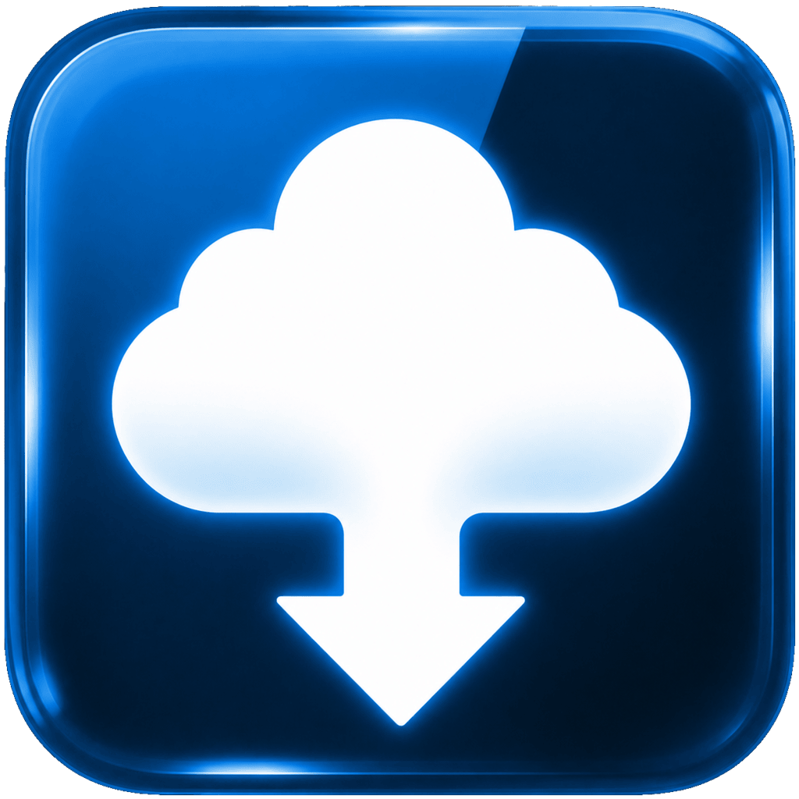

<div align="center">



# Canvas Downloader

**Batch-download your entire Canvas LMS course library in minutes.**  
Smart sync, AI-ready file conversion, and zero cloud dependency - all in a native desktop app.

[](https://github.com/birkls/Canvas_LMS_batch_file_downloader/releases)
[](https://python.org)
[](https://github.com/birkls/Canvas_LMS_batch_file_downloader/releases)
[](https://canvas.instructure.com/doc/api/)
[](LICENSE)

[](https://ko-fi.com/Z8Z01ZOY6Q)

[**Download for Windows**](https://github.com/birkls/Canvas_LMS_batch_file_downloader/releases/latest) · [**Download for macOS**](https://github.com/birkls/Canvas_LMS_batch_file_downloader/releases/latest) · [**View Releases**](https://github.com/birkls/Canvas_LMS_batch_file_downloader/releases)

</div>

---

## What Is This?

Canvas Downloader is a **standalone desktop application** that connects directly to your university's Canvas LMS via the official API and batch-downloads every file from every course - no browser extension, no web scraping, no cloud middleman.

**Keep your course folders up to date with one click.** The sync engine tracks exactly what changed since your last run - new files, updated slides, teacher edits - and only touches what needs updating.

**Turn your downloads into AI-ready study material automatically.** One toggle converts every PowerPoint, spreadsheet, video, and code file into a format any AI tool (NotebookLM, ChatGPT, Claude) can read and reason over.

Free, open source, and runs entirely on your machine.

---

## Features

### Core Download Engine

- **Multi-course batch download** - select any combination of courses and pull everything in one shot
- **Canvas module structure preserved** - files land in the same folder hierarchy Canvas uses
- **Async parallel downloads** - `asyncio` + `aiohttp` with configurable concurrency; Canvas rate-limit backoff built in
- **Atomic file writes** - `.part` staging pattern; a crash mid-download never leaves corrupted files
- **File size filters** - skip large video files you don't need right now. Skipped files are marked as *ignored* in the sync manifest (by design, so future syncs don't keep re-listing them) - restore them anytime from the Sync Hub's ignored-files list, even after raising the limit
- **Full Canvas content support** - module files, assignments, syllabi, announcements, discussions, quizzes, and rubrics

### Sync Mode

Keep any local folder **permanently in sync** with its Canvas course - one click to pull every new lecture, updated slide deck, and freshly posted file since your last run. The sync engine tracks seven distinct file states:

| State | Description | Default Action |
|---|---|---|
| **New** | Canvas has it, you don't | Download |
| **Update (clean)** | Canvas updated, your copy is untouched | Replace in place |
| **Update (modified)** | Canvas updated, but you edited yours | Keep yours + save new as `_NewVersion` |
| **Deleted locally** | You deleted it, Canvas still has it | Skip (respects intent) |
| **Deleted on Canvas** | Teacher removed it | Info only - never deletes from disk |
| **Up-to-date** | Identical on both sides | Nothing (shown as count badge) |
| **Ignored** | Permanently excluded by you | Always skip |

Change detection uses **MD5 fingerprinting** stored in a per-folder SQLite manifest (`.canvas_sync.db`). Renamed files are resolved with **Levenshtein distance** so a renamed lecture slides file isn't treated as a brand-new download.

### AI Optimization - NotebookLM-Ready in One Click

Enable a single toggle and every download is automatically converted into a format Google's NotebookLM (or any AI tool) can ingest directly - no manual reformatting needed:

| Source | Output | Platform | Engine |
|---|---|---|---|
| `.pptx` | `.pdf` | Win + macOS | COM automation / AppleScript |
| `.doc` `.docm` | `.pdf` | Win + macOS | COM automation / AppleScript |
| `.xlsx` `.xlsm` | `.pdf` + `_Data.txt` (structured AI data) | Win + macOS | openpyxl (data) / COM + AppleScript (PDF) |
| `.xls` (legacy) | `.pdf` only | Win + macOS | COM automation / AppleScript |
| `.mp4` `.mov` `.avi` `.mkv` `.webm` (+15 more) | `.mp3` | Win + macOS | FFmpeg via MoviePy |
| `.html` | `.md` | Win + macOS | BeautifulSoup + markdownify |
| `.zip` `.tar` `.tar.gz` | extracted | Win + macOS | stdlib (zip-bomb protection) |
| 50+ code extensions | `.py.txt` `.js.txt` etc. (extension appended - preserves format hint) | Win + macOS | UTF-8 native |

The Excel data sidecar (`Financials_Data.txt`) is a structured plain-text file containing every sheet's data in CSV format with a cell coordinate grid (A1, B2...) that matches the companion PDF, formula annotations (`250 [Formula: =B2*C2]`), merged cell values repeated across the full merged range, and hidden row/column markers. This lets AI tools cross-reference the visual PDF with precise cell data and understand the underlying formulas - far more useful than PDF parsing alone.

**Note:** The AI data file is generated only for modern Excel formats (`.xlsx`, `.xlsm`). Legacy `.xls` files (Excel 97-2003 format) are converted to PDF only, as the data extraction engine (openpyxl) does not support the binary `.xls` format.

Safety details: archives enforce a **50 GB uncompressed limit** and **100:1 compression-ratio guard**. Video conversion wraps FFmpeg cleanup in a thread-pool with a 10-second timeout to survive corrupt files.

### Preset System

Save your exact download configuration - courses, content types, conversion settings, output folder - as a named preset. Recall it in one click next time. Presets are stored as plain JSON and can be shared between machines.

### Progress & Monitoring

- Real-time progress dashboard with per-course file counts and MB transferred
- Terminal-style log with color-coded status lines
- Cancel at any time (mid-download, mid-conversion)
- System notification + completion sound on finish
- Exportable error log for any failed files

---

## Download & Install

No Python installation required. Grab the latest release for your platform:

| Platform | Package | Requirements |
|---|---|---|
| **Windows 10/11** | `Canvas_Downloader_Setup.exe` | Nothing - batteries included |
| **macOS 11+** | `Canvas Downloader.dmg` | macOS 11 Big Sur or later |

### Windows

1. Run `Canvas_Downloader_Setup.exe`
2. Follow the installer - it places a shortcut on your Desktop
3. Launch **Canvas Downloader**

> **Windows SmartScreen warning?** Click "More info" → "Run anyway". The app is unsigned (code-signing certificates cost ~$500/year). The source is fully open above.

### macOS

1. Open `Canvas Downloader.dmg`
2. Drag `Canvas Downloader.app` to your `/Applications` folder
3. **First launch:**
   - macOS 13/14: Right-click the app → **Open** → **Open** (Gatekeeper bypass for unsigned apps)
   - macOS 15 (Sequoia) or newer: double-click (it gets blocked), then go to **System Settings → Privacy & Security**, scroll down, and click **Open Anyway**

#### What macOS will ask you on first run (this is normal!)

Because the app is unsigned (an Apple Developer certificate costs $99/year — [support the project](https://ko-fi.com/brkbuilds) to help us get one), macOS is extra careful and asks for each permission individually. **Every prompt appears only once.** Here is each one, in order, and what to click:

| Prompt | Why it appears | What to click |
|---|---|---|
| *"Canvas Downloader" was blocked...* | The app is not signed with a paid Apple certificate | **Open Anyway** (in Privacy & Security settings) |
| *...wants to access key "CanvasDownloader" in your keychain* | Loads/saves your Canvas token securely in the macOS Keychain | **Always Allow** (enter your **Mac login password**, not your Canvas token) |
| *...wants access to control "Google Chrome"* | Opens the app in its own window and closes it again when you quit | **OK** |
| *...wants access to files in your Downloads/Documents folder* | Saves your course files where you chose | **OK** / **Allow** |
| *...wants access to control "Microsoft PowerPoint" (or Word / Excel)* | Converts slides and documents to PDF for you | **OK** |

> ⚠️ Heads up: after **updating** to a new version of Canvas Downloader, macOS treats it as a new app and the Keychain prompt will appear once again. Click **Always Allow** — your saved login is intact.

#### Uninstalling (macOS)

1. Log out inside the app (removes your Canvas token from the Keychain)
2. Drag `Canvas Downloader.app` from Applications to the Trash
3. Optional: delete `~/Library/Application Support/CanvasDownloader` (settings & sync pairs)

---

## Quick Start

### 1. Get Your Canvas API Token

1. Log in to your institution's Canvas → **Account → Settings**
2. Scroll to **Approved Integrations** → **+ New Access Token**
3. Give it a name, no expiry needed, and copy the token

Your token is stored in your OS keyring (Windows Credential Manager / macOS Keychain) - never written to disk in plaintext.

### 2. Download Mode

There are two paths depending on whether you've been here before:

**First time - Custom Download:**
1. Launch Canvas Downloader and connect with your token + Canvas URL
2. **Step 1** - Select which courses to download
3. **Step 2** - Configure what to pull: module files, assignments, quizzes, syllabi, etc. Enable the AI conversion suite if you want NotebookLM-ready output
4. **Step 3** - Watch the live dashboard; a chime plays when everything is done

**Returning user - Quick Download:**
- If you've saved a preset from a previous session, it appears on the home screen
- Hit **Quick Download** to re-run your saved configuration in one click - no stepping through settings again

### 3. Sync Mode

**First time - Analyze, Review & Sync:**
1. Switch to **Sync Mode** from the sidebar
2. Create a sync pair: pick a local folder and link it to a Canvas course
3. Hit **Analyze** - the engine diffs your folder against Canvas and categorises every file (new, updated, modified, deleted, etc.)
4. Review the diff per course, adjust per-file actions if needed, confirm, and execute

**Returning user - Quick Sync:**
- Once sync pairs are configured, the **Quick Sync All** button re-runs the full analysis and sync for all your pairs in one go - no wizard required

---

## Architecture

Canvas Downloader is ~220 KB of Python across a deliberately modular structure. Here's how the major pieces fit together:

```
start.py                     ← Cross-platform launcher
├── Streamlit server (127.0.0.1:8501, daemonized thread)
└── pywebview / CustomTkinter window (main thread, required for Cocoa on macOS)

app.py                       ← Download mode orchestrator
sync_ui.py                   ← Sync mode orchestrator

ui/                          ← All Streamlit UI components
  course_selector.py         ← Step 1: multi-select with CBS filters
  download_settings.py       ← Step 2: Card 1 (files) / Card 2 (content) / Card 3 (AI)
  presets.py                 ← Preset engine + hub modal
  sync_dialogs.py            ← Sync pair configuration
  sync_review.py             ← Per-file diff review screen
  sync_confirmation.py       ← Pre-execution confirmation

core/
  state_registry.py          ← Single source of truth for all session state keys & defaults
  cancellation.py            ← Global cancel flags + async polling

engine/
  progress_dashboard.py      ← Shared terminal log + visual dashboard
  post_processing_bridge.py  ← Unified post-processing init (Download + Sync share one pipeline)
  applescript_bridge.py      ← macOS osascript runner (shared by all Office converters)

sync/
  analysis.py                ← Diff engine: Canvas vs local, produces 7-state categorisation
  execution.py               ← Background async execution
  persistence.py             ← Atomic JSON (os.replace + threading.Lock)
  completion.py              ← Post-sync summary + history logging

canvas_logic.py              ← Canvas API wrapper + async download engine
sync_manager.py              ← SQLite manifest engine with Levenshtein collision resolution
post_processing.py           ← Unified conversion pipeline runner

# Converters (each a standalone module)
pdf_converter.py             ← PowerPoint → PDF
word_converter.py            ← Word → PDF
excel_converter.py           ← Excel → PDF (COM/AppleScript) + structured AI data file (openpyxl)
video_converter.py           ← Video → MP3
md_converter.py              ← HTML → Markdown
code_converter.py            ← Code files → .txt
archive_extractor.py         ← ZIP/TAR extraction with bomb protection
url_compiler.py              ← External links → .txt for NotebookLM
```

### Notable Engineering Decisions

**Why Streamlit inside a desktop window?**  
Streamlit's reactive model makes complex multi-step wizard UIs fast to build and easy to reason about. `pywebview` (Windows) and a CustomTkinter status window + native Chrome (macOS) wrap it into a proper desktop app without Electron or a full Qt install.

**Why SQLite for sync state?**  
SQLite in WAL mode gives concurrent-read safety, survives crashes mid-sync, and travels with the folder (`.canvas_sync.db` is hidden alongside the synced files). A plain JSON manifest would need locking at every write and lacks atomic transactions.

**How does cross-platform Office automation work?**  
Windows uses `win32com.client` to drive Word/Excel/PowerPoint as COM servers. macOS uses `osascript` AppleScript via a shared bridge (`engine/applescript_bridge.py`). Both branches implement identical semantics - the calling code never checks the platform. COM instances are self-healing: stale or crashed instances are detected and restarted mid-batch.

**What makes the sync change detection reliable?**  
Files are fingerprinted with MD5 on first download and the hash is stored in SQLite. On subsequent syncs the manifest hash is compared against both the local file and the Canvas file's reported checksum. Levenshtein distance matching handles teacher renames (e.g. `Lecture 3.pdf` → `Lecture 03 - Updated.pdf`) without double-downloading.

---

## Tech Stack

| Layer | Technology |
|---|---|
| UI Framework | [Streamlit 1.51](https://streamlit.io) |
| Desktop Window | [pywebview 5.1](https://pywebview.flowrl.com) (Windows) · CustomTkinter + Chrome (macOS) |
| Canvas API | [canvasapi 3.3](https://canvasapi.readthedocs.io) |
| Async HTTP | [aiohttp 3.11](https://docs.aiohttp.org) + asyncio |
| Async File I/O | [aiofiles 24.1](https://github.com/Tinche/aiofiles) |
| Sync Database | SQLite3 (stdlib) - WAL mode, per-folder manifest |
| Windows Automation | [pywin32 308](https://github.com/mhammond/pywin32) - COM interface to Office |
| macOS Automation | `osascript` AppleScript - feature-parity with COM |
| Video Processing | [MoviePy 2.1](https://zulko.github.io/moviepy/) + FFmpeg via imageio_ffmpeg |
| HTML → Markdown | [BeautifulSoup4 4.12](https://www.crummy.com/software/BeautifulSoup/) + [markdownify 0.14](https://github.com/matthewwithanm/python-markdownify) |
| Credential Storage | [keyring 25.6](https://github.com/jaraco/keyring) - OS Keychain / Credential Manager |
| Notifications | win11toast (Windows) · pync (macOS) |
| Packaging | [PyInstaller](https://pyinstaller.org) + Inno Setup (Windows installer) |

---

## Building from Source

Requires Python 3.11+ and the dependencies in `requirements.txt`.

```bash
# Clone
git clone https://github.com/birkls/Canvas_LMS_batch_file_downloader.git
cd Canvas_LMS_batch_file_downloader

# Install dependencies
pip install -r requirements.txt

# Run from source
python start.py
```

### Packaging

**Windows** (produces `Canvas_Downloader_Setup.exe`):
```bash
pyinstaller Canvas_Downloader.spec
# Then open Canvas_Downloader_Setup.iss in Inno Setup Compiler
```

**macOS** (produces `Canvas Downloader.app`):
```bash
pyinstaller --clean Canvas_Downloader_macOS.spec
codesign --force --deep -s - --entitlements entitlements.mac.plist "Canvas Downloader.app"
```

The macOS spec includes the `com.apple.security.automation.apple-events` entitlement so AppleScript Office automation works in a sandboxed build.

---

## Security Notes

- Your Canvas API token is stored in your OS keyring (Windows Credential Manager / macOS Keychain). On Windows, if the keyring is unavailable, an encrypted DPAPI fallback file is used - the ciphertext is bound to your Windows user account and unreadable by anyone else
- The Streamlit server binds to `127.0.0.1` only - zero network exposure beyond your own machine. Note for **shared computers** (e.g. lab PCs with multiple users logged in at once): localhost ports are reachable by other local users on the same machine, and the app auto-signs-in from your keyring - prefer running it on your personal device
- Archive extraction enforces a 50 GB / 100:1 ratio hard limit against zip bombs
- All Canvas data rendered into HTML is passed through `html.escape()` before injection
- Debug logs redact Bearer tokens and signed download-URL tokens (`verifier=`) before anything is written to disk

---

## Contributing

Issues and PRs are welcome. If you find a bug or want to request a feature, open an issue on GitHub.

When contributing code, follow the CSS/UI rules in `CLAUDE.md` - they exist because we learned the hard way.

---

## License

MIT - see [LICENSE](LICENSE) for details.

---

<div align="center">
<sub>Built with Python, Streamlit, and an unreasonable amount of CSS debugging.</sub>
</div>
